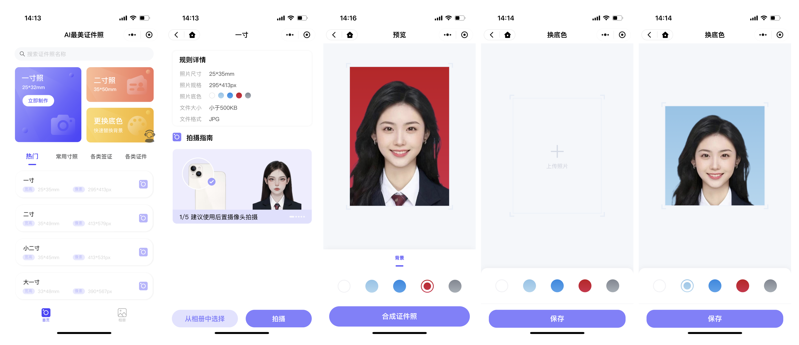

# 预览：

<p align="center"></p>

# 项目介绍

# <p align="center">AI最美证件照App</p>
<p align="center"></p>


**相关项目**：

- 如需要小程序后端：请微信联系 **wxid_mwzt6er4omrb21**

------

# ⭐项目介绍

## 前端

```
基于原生小程序编写的生成证件照的小程序页面，这里主要是微信小程序的页面
```

------

## 后端

```
后台基于Zeyi-Lin大佬的HivisionIDPhotos项目为基础，使用python语言编写一整套后台服务
```

### 主要功能

- #### 人像抠图

  

- #### 照片换底色

  

- #### 生成六寸排版照

  

- #### 自定义证件照尺寸

  

- #### 保存图片至用户相册

# 后期更新计划

```
1.美颜（waiting）

2.智能换正装（waiting）
```

# 🔧部署

```
1.微信开发者工具打开项目后，修改setting.js中的接口地址

2.通过 npm 安装
  npm i @vant/weapp -S --production
  
3.打开微信开发者工具，点击 工具 -> 构建 npm，并勾选 使用 npm 模块 选项，构建完成后，即可引入组件。
```


## 📧其它

您可以通过以下方式联系我:

微信：wxid_mwzt6er4omrb21